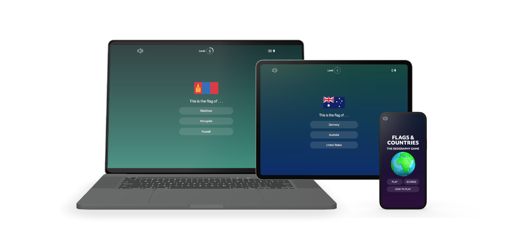
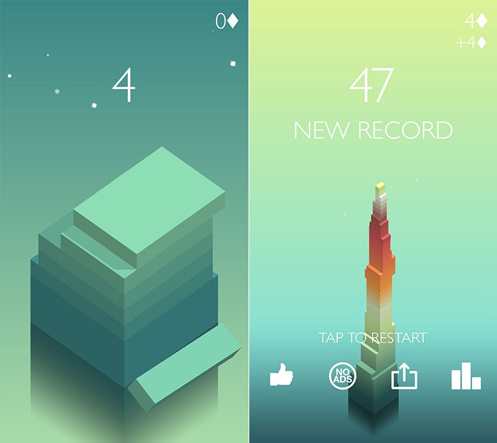
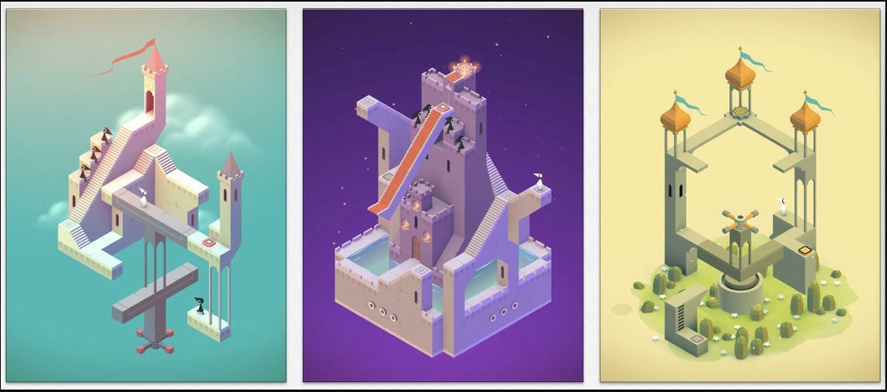
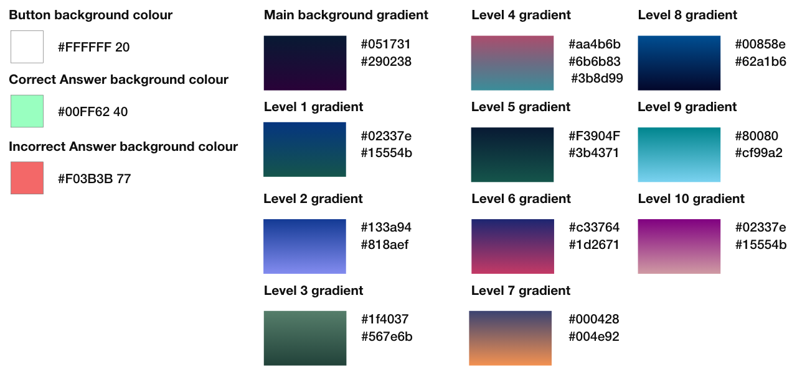
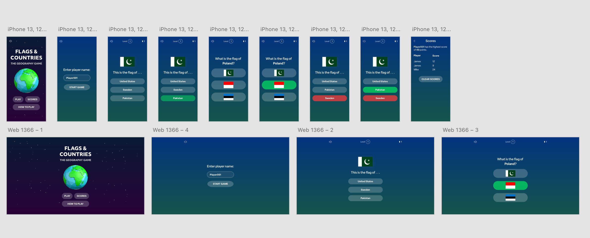
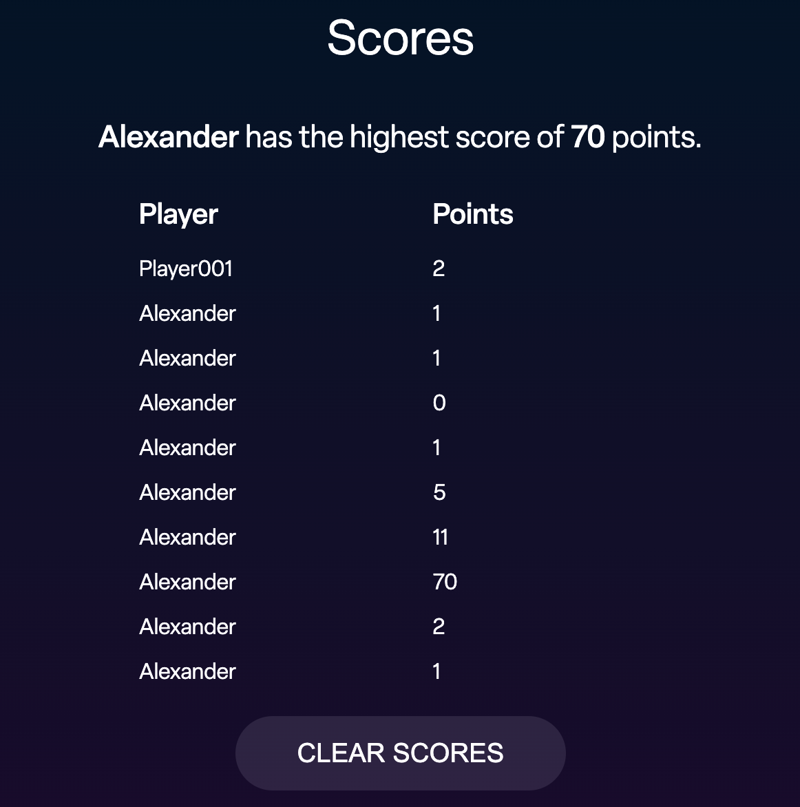
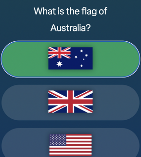
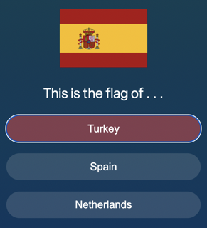
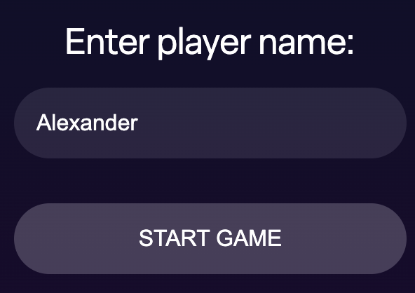

# Flags & Countries

Flags & Countries is an interactive responsive geography quiz game. Its purpose is to test a player's knowledge of the flags of the countries of the world and help them improve their knowledge. 

## Design Process

### UX Design Process

#### User Stories
- As a user I would like to improve my knowledge of world flags.
- As a user I wish to improve my students' geography knowledge in a fun way.  
- As a user I would to see my previous game scores so I can track my progress as I play the game.
- As a user I want to practice my knowledge of flags on multiple devices including smartphones.

#### Game Design
##### Game elements
-	There are 220 countries/territories in the question bank.
-	To complete the game a user must answer 70 questions correctly. That means 210 countries will feature in a complete game.
-	If they answer a question incorrectly, they lose and must start over.
-	There are 7 questions in each level and 10 levels
-	There are two question formats and these alternate
	- What is the flag of [country name]? (User then picks one of 3 flag pictures)
	- This is the flag of . . .   (User then picks a country name from a list of three countries) 
-	The levels get progressively harder.
-	Maximum score of 70 with 1 point per correct answer
- 	The game is multiple-choice with 3 options per question.

### Visual Design

#### Colour Scheme

- I took colour palette inspiration from the games Mounument Valley and Stack. I wanted to create a very clean and minimal design that made use of changing background gradients.

	

	

- The Flags & Countries colour palette. The buttons make use of transparency.

	

#### Typography

Adobe Fonts:
- [Objektiv](https://fonts.adobe.com/fonts/objektiv) is the fotn used for the H1 and H2 tags

- [Elza](https://fonts.adobe.com/fonts/elza) is used for all other elements containing text. I picked it for its modern minimalism and readability

#### Mockups
-	Before starting work on devloping the game I created desktop and mobile high fidelity mockups to work from. 

## Features
### Existing Features
- Two question types. To make the game more fun the format of the questions alternates.

- Mute button
	- The game includes a toggle button that turns the sound effects on or off. It is good UX practice giving the user control over sounds generated by the user.
	- The button indicates the sound status visually.

	
	

- Level progress ring
	- This shows what level the user is currently on but it also shows the progress until the next level is reached.

	

- Score counter
	- In the top right corner a counter keeps track of the user's score.

	

- Score modal
	- This shows the current high score and which plauer achieved the score. 
	- There is also a table showing all of the save scores and which player achieved them.
	- There is a button to clear the scores.

	
- Answer buttons
	- The game answer buttons visually communicate whether a selected answer was correct or incorrect by flashing either red or green.

	

	

- Level up
	- To make the game engaging when a user moves onto another level a sound effect andanimation plays, letting the user know they are succeeding in the game. 
	- Each level features a different background gradient which animates in.

	

	- Player Name

	- Before starting a game a player can enter their name. This is then saved to local storage. This allows different players to play and keep track of who is winning in the scores table.

	

- Sound Effects
	- To make the game more engaging it features four sounds effects:
		- Correct Answer
		- Incorrect / game over
		- Level Up
		- Game won

### Features Left to Implement
- Autosave and saving game progress. If a user leaves the website in the middle of a game their progress will have been saved to local storage.
- The time taken for a user to complete the game will also be recorded, allowing for ranking of the quickest games played. This will add another competitive elemtn to the game.
- Global scoreboard that ranks users on how many questions they answered and how quickly.

## Technologies Used

- HTML 5
	- Local Storage
		- The game uses local storage for storing the list of scores, top scorer and player name.
- CSS
- JavaScript

## Tools used
- For writing code I used [Visual Studio Code](https://code.visualstudio.com/) which I also for Git commands and pushing to GitHub

- [GitHub](https://github.com]) was used for hosting the online repository, it provides an online version of Git, a source code management tool.

- [AdobeXD](https://www.adobe.com/uk/products/xd.html) was used to create high fidelity mockups before I started coding. 

- [Markdown Editor](https://apps.apple.com/ie/app/markdown-editor/id1458220908?mt=12) by Satoshi Iwaki was used for editing .MD files.

- [AutoPrefixer](https://autoprefixer.github.io/) was used to add browser specifc prefixes.

- Adobe Illustrator was used to make several of the game graphics including the score icon and the game complete graphics.

## Testing

- For all testing, please refer to the [TESTING.md](TESTING.md) file.

## Deployment

The site was deployed to GitHub pages. The steps to deploy are as follows:
- In the [GitHub repository](https://github.com/ancfoster/flags-and-countries), navigate to the Settings tab
- From the source section drop-down menu, select the Main Branch, then click "Save".
- The page will be automatically refreshed with a detailed ribbon display to indicate the successful deployment.
- The live link can be found [here](https://ancfoster.github.io/flags-and-countries/).

### Local Deployment

In order to make a local copy of this project, you can clone it. In your IDE Terminal, type the following command to clone my repository:

`git clone https://github.com/ancfoster/Motu-Lani.git`

Alternatively, if using Gitpod, you can click below to create your own workspace using this repository.

## Credits

### Technical documentation & tutorials

- I used a tutorial and code snippet by [Jeremias Menichelli](https://css-tricks.com/building-progress-ring-quickly/) to help make the progress ring and update it.
- MDN documentaton on how to use the [animationend](https://developer.mozilla.org/en-US/docs/Web/API/HTMLElement/animationend_event) event
- MDN documentation on using [localStorage](https://developer.mozilla.org/en-US/docs/Web/API/Window/localStorage) 
- MDN documentation on how to use [JSON stringify and parse](https://developer.mozilla.org/en-US/docs/Web/JavaScript/Reference/Global_Objects/JSON) which was used for the storage and retrieval of multiple player names + scores in localStorage.

### Media

All flag images were obtained from Wikipedia.

- In the project flag files have the naming format 001.png 002.png etc. This is deliberate, so as to prevent cheating by a user trying to determine the answer by looking at 

[Globe Image](https://www.turbosquid.com/3d-models/3d-cartoon-world-earth/1054676)

[Speaker Icons](https://iconmonstr.com/sound-thin-svg/)

[Back chevron](https://fonts.google.com/icons)

#### Sound Effects
- Correct answer & level up sounds by [BlackDragonFX](https://audiojungle.net/item/the-correct/36866229)
- Game over / incorrect answer sound by [Shikkon](https://audiojungle.net/item/incorrect-answer/2024374)

- Game completed sound by [PrankAudio](https://audiojungle.net/item/game-win-2/34612805)

### Acknowledgements
I would like to thank my Code Institute mentor Tim Nelson for providing invaluable guidance duirng the development of this project. I also wish to thank my wife Alice for helping me by testing the game.