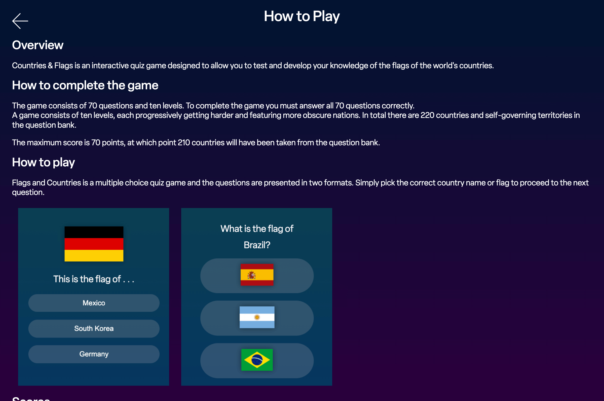
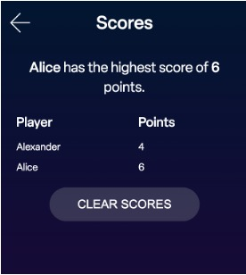

# Testing
 Click to return back to [README.md](README.md)

#### Note about accessibility 
- When building this project every effort has been to taken to follow best practice and build in accessibility. However the visual nature of the questions in this game mean it cannot be played by people with high levels of visual impairment.
- The flag image alt tags are not the name of the country e.g 'Sweden' 'Japan' 'Mexico' as this would allow for cheating and ultimately undermine the point of the game as the answers would be read out by a screen reader.
- All other elements follow accessibility practices. 

## User testing
- During the development of the game I sought user feedback from my mentor and another user. 

- From this user testing it became apparent there was an issue with the navigation of the game. Unless a user lost the game there was no way for them to return to the main menuw without refreshing the page.
- Below you can see before and after screenshots when the control bar was redesigned to implement the user feedback.

	

	

	- The new modal that appears, confirming the user's choice. This is good UX practice, in case the user accidently hit the back/end game button whilst playing.
		
		 

- A modal confirmation dialog was added to the scores page. This is a good UX practice, implementing defensive design and confirming an irreversible choice with the user. This was added after user testing feedback.
	
		 

## Browser Compatibility

- **Main Menu**

| Browser | Screenshot |
|---|---|
|||
|||
|||

- **Question Type 1**

| Browser | Screenshot |
|---|---|
|||
|||
|||

- **Question Type 2**

| Browser | Screenshot |
|---|---|
|||
|||
|||

- **Game Over**

| Browser | Screenshot |
|---|---|
|||
|||
|||

- **How to Play**

| Browser | Screenshot |
|---|---|
|||
|||
|||

- **Scores**

| Browser | Screenshot |
|---|---|
|||
|||
|||

## Code Validation

#### W3C HTML Validator
All HTML files have passed through the W3C validator.

| File | Validator Result | Screenshot |
|---|---|---|
|index.html|[Link](https://validator.w3.org/nu/?doc=https%3A%2F%2Fancfoster.github.io%2Fflags-and-countries%2Findex.html)||
|how_to_play.html|[Link](https://validator.w3.org/nu/?doc=https%3A%2F%2Fancfoster.github.io%2Fflags-and-countries%2Fhow_to_play.html)||
|scores.html|[Link](https://validator.w3.org/nu/?doc=https%3A%2F%2Fancfoster.github.io%2Fflags-and-countries%2Fscores.html)||

#### W3C CSS Validator
All CSS files have passed through the W3C validator.

| File | Validator Result | Screenshot |
|---|---|---|
|style.css|[Link](https://jigsaw.w3.org/css-validator/validator?uri=https%3A%2F%2Fancfoster.github.io%2Fflags-and-countries%2Fassets%2Fcss%2Fstyle.css&profile=css3svg&usermedium=all&warning=1&vextwarning=&lang=en)||
|how_to_play.css|[Link](https://jigsaw.w3.org/css-validator/validator?uri=https%3A%2F%2Fancfoster.github.io%2Fflags-and-countries%2Fassets%2Fcss%2Fhow_to_play.css&profile=css3svg&usermedium=all&warning=1&vextwarning=&lang=en)||
|scores.css|[Link](https://jigsaw.w3.org/css-validator/validator?uri=https%3A%2F%2Fancfoster.github.io%2Fflags-and-countries%2Fassets%2Fcss%2Fscores.css&profile=css3svg&usermedium=all&warning=1&vextwarning=&lang=en)||

#### JSHint 
All JavaScript code was analysed with [JSHint](https://jshint.com)

| File | Screenshot |
|---|---|
|script.js||
|questions.js||
|how_to_play.js||
|scores.js||

Notes
- The undefined variables in script.js are defined in questions.js
- The variable `questions` that is declared in questions.js is used in script.js
  

## Lighthouse Score
| File | Screenshot |
|---|---|
|index.html||
|how_to_play.html||
|scores.html||

## Responsiveness

- **Main Menu Screen**

| Device | Screenshot |
|---|---|
| iPhone SE 2 (375 x 667) | |
| Nexus 7 Tablet (600 x 960) |  |
| Laptop MDPI (1200 x 800) |  |

- **Question Type 1**

| Device | Screenshot |
|---|---|
| iPhone SE 2 (375 x 667) | |
| Nexus 7 Tablet (600 x 960) |  |
| Laptop MDPI (1200 x 800) |  |

- **Question Type 2**

| Device | Screenshot |
|---|---|
| iPhone SE 2 (375 x 667) | |
| Nexus 7 Tablet (600 x 960) |  |
| Laptop MDPI (1200 x 800) |  |

- **Game Over**

| Device | Screenshot |
|---|---|
| iPhone SE 2 (375 x 667) | |
| Nexus 7 Tablet (600 x 960) |  |
| Laptop MDPI (1200 x 800) |  |

- **How to Play**

| Device | Screenshot |
|---|---|
| iPhone SE 2 (375 x 667) | |
| Nexus 7 Tablet (600 x 960) |  |
| Laptop MDPI (1200 x 800) |  |

- **Scores**

| Device | Screenshot |
|---|---|
| iPhone SE 2 (375 x 667) | |
| Nexus 7 Tablet (600 x 960) |  |
| Laptop MDPI (1200 x 800) |  |

## User Story Testing

- As a user I would like to improve my knowledge of world flags.

	
- As a user I wish to improve my students' geography knowledge in a fun way.  
	
- As a user I would to see my previous game scores so I can track my progress as I play the game.

	

- As a user I want to practice my knowledge of flags on multiple devices including smartphones.
	
	

## Known bugs and issues 

- In Safari on iOS/iPad OS the sound effects level_up.mp3 and incorrect_gameover.mp3 do not played when called. These work as expected on desktop Safari and in all other browsers. The sound effect correct.mp3 does play as expected on Safari for iOS/iPad OS.
- In Firefox the following error is thrown:

	`downloadable font: Table discarded (font-family: "elza" style:normal weight:500 stretch:100 src index:0) source: https://use.typekit.net/af/9ca581/00000000000000007735f906/30/l?primer=7cdcb44be4a7db8877ffa5c0007b8dd865b3bbc383831fe2ea177f62257a9191&fvd=n5&v=3`
	- This is an issue caused by a bug in Firefox which is documented [here](https://bugzilla.mozilla.org/show_bug.cgi?id=1185685)
