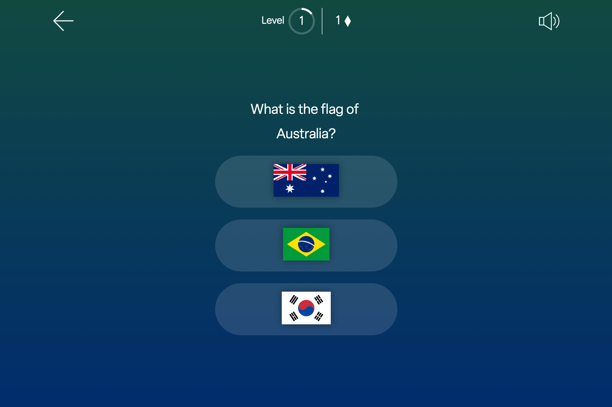

# Testing
 Click to return back to [README.md](README.md)

#### Note about accessibility 
- When building this project every effort has been to taken to follow best practice and build in accessibility. However the visual nature of the questions in this game mean it cannot be played by people with high levels of visual impairment.
- The flag image alt tags are not the name of the country e.g 'Sweden' 'Japan' 'Mexico' as this would allow for cheating and ultimately undermine the point of the game as the answers would be read out by a screen reader.
- All other elements follow accessibility practices. 

## User testing
- During the development of the game I sought user feedback from my mentor and another user. 

- From this user testing it became apparent there was an issue with the navigation of the game. Unless a user lost the game there was no way for them to return to the main menuw without refreshing the page.
- Below you can see before and after screenshots when the control bar was redesigned to implement the user feedback.

	

	

	- The new modal that appears, confirming the user's choice. This is good UX practice, in case the user accidently hit the back/end game button whilst playing.
		
		 

## Browser Compatibility

- **Main Menu**

| Browser | Screenshot |
|---|---|
|||
|||
|||

- **Question Type 1**

| Browser | Screenshot |
|---|---|
|||
|||
|||

- **Question Type 2**

| Browser | Screenshot |
|---|---|
|||
|||
|||

## Code Validation

#### W3C HTML Validator
All HTML files have passed through the W3C validator.

| File | Validator Result | Screenshot |
|---|---|---|
|index.html|[Link](https://validator.w3.org/nu/?doc=https%3A%2F%2Fancfoster.github.io%2Fflags-and-countries%2Findex.html)||
|how_to_play.html|[Link](https://validator.w3.org/nu/?doc=https%3A%2F%2Fancfoster.github.io%2Fflags-and-countries%2Fhow_to_play.html)||

#### W3C CSS Validator
All CSS files have passed through the W3C validator.

| File | Validator Result | Screenshot |
|---|---|---|
|style.css|[Link](https://jigsaw.w3.org/css-validator/validator?uri=https%3A%2F%2Fancfoster.github.io%2FMotu-Lani%2Fassets%2Fcss%2Fstyle.css&profile=css3svg&usermedium=all&warning=1&vextwarning=&lang=en)||
|how_to_play_style.css|[Link](https://jigsaw.w3.org/css-validator/validator?uri=https%3A%2F%2Fancfoster.github.io%2FMotu-Lani%2Fassets%2Fcss%2Fhome_styles.css&profile=css3svg&usermedium=all&warning=1&vextwarning=&lang=en)||

#### JSHint 
All JavaScript code was analysed with [JSHint](https://jshint.com)

| File | Screenshot |
|---|---|
|script.js||
|questions.js||

## Responsiveness

- **Main Menu Screen**

| Device | Screenshot |
|---|---|
| iPhone SE 2 (375 x 667) | |
| Nexus 7 Tablet (600 x 960) |  |
| Laptop MDPI (1280 x 800) |  |

## User Story Testing (if you have user stories from the README)
    if so, just copy/paste your user stories here, and then provide a screenshot of each from the finished site, usually this is a combo of UserStory+Feature screenshot
## Unfixed Bugs / Known Issues

- In Safari on iOS/iPad OS the sound effects level_up.mp3 and incorrect_gameover.mp3 do not played when called. These work as expected on desktop Safari and in all other browsers. The sound effect correct.mp3 does play as expected on Safari for iOS/iPad OS.
- In Firefox the following error is thrown:

	`downloadable font: Table discarded (font-family: "elza" style:normal weight:500 stretch:100 src index:0) source: https://use.typekit.net/af/9ca581/00000000000000007735f906/30/l?primer=7cdcb44be4a7db8877ffa5c0007b8dd865b3bbc383831fe2ea177f62257a9191&fvd=n5&v=3`
	- This is an issue caused by a bug in Firefox which is documented [here](https://bugzilla.mozilla.org/show_bug.cgi?id=1185685)
